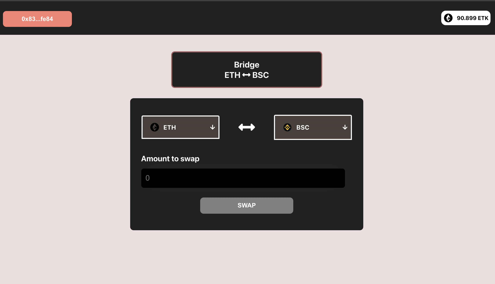

# BSC - ETH Bridge


**This repo contains the entire bridging app from frontend to the backend and surely the contracts**



---

**These are the things that you'll get:**

- **ETK (Token on ethereum chain)**
- **BTK (Token on binance chain)**
- **ETHBridge (Token on ethereum chain)**
- **BSCBridge (Token on binance chain)**

---

# **Tech-stack**

### Prerequisites

- Git
- Yarn
- Npx

### **Bridge-Contracts Folder**

---

- **Solidity**
- **Hardhat**
- **Typescript**
- **Eslint**
- **Chai**
- **Prettier**
- **Typechain**
- **Openzeppelin**
- **Ethers**
- **Waffle**
- **Solhint**

---

### **Bridge-Frontend Folder**

---

- **Typescript**
- **ReactJS**
- **Toast**
- **Jest**
- **Axios**
- **Usedapp**
- **Fontawesome**

---

### **Bridge-Backend Folder**

---

- **Typescript**
- **dotenv**
- **Winston**
- **express**
- **ts-node**
- **typechain**
- **cors**

---

# **Scripts**

_Wanna contribute? Cool! Fork the repo and run the following commands for the following folders based on which part you want to contribute for_

---

### **Bridge-Contracts Folder**

---

**Install the dependencies**

```bash
yarn
```

**Compile the contracts**

```bash
yarn compile
```

**Run the test suite**

```bash
yarn test
```

**Run the entire coverage test**

```bash
yarn coverage
```

_Testing a specific file_

```bash
yarn test test/<test-file-name>
```

---

### **Bridge-Frontend Folder**

---

**Install the dependencies**

```bash
yarn
```

**Start the dev server**

```bash
yarn start
```

**Running tests for components**

```bash
yarn test
```

**Create a prod build**

```bash
yarn build
```

---

### **Bridge-Backend Folder**

---

**Install the dependencies**

```bash
yarn
```

**Start the dev server**

```bash
yarn dev
```

**Creating a build set**

```bash
yarn build
```

**Starting the build server**

```bash
yarn start
```

**Generating the types based on abis**

```bash
yarn generate
```

**Utility Script Inside Bridge-Contracts**

---

_Note: The following script copies the abis from contracts folder to backend and frontend respectively. When you want to generate types based on the abis, make sure to extract out the json file_

---

**Copying the abi's**

```bash

cd Bridge-Contracts
ts-node fileTransfer.ts
```

---
